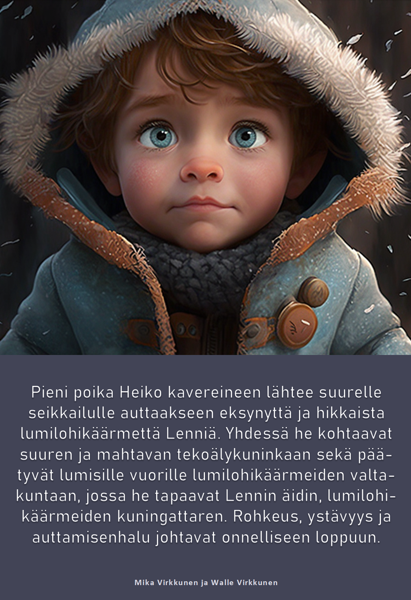
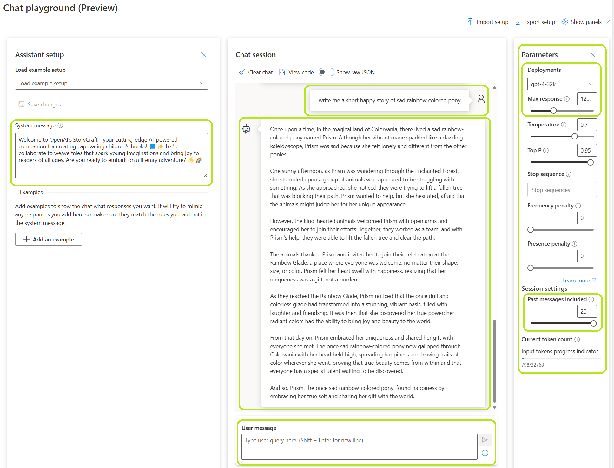
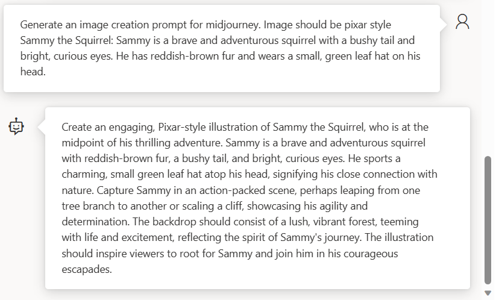
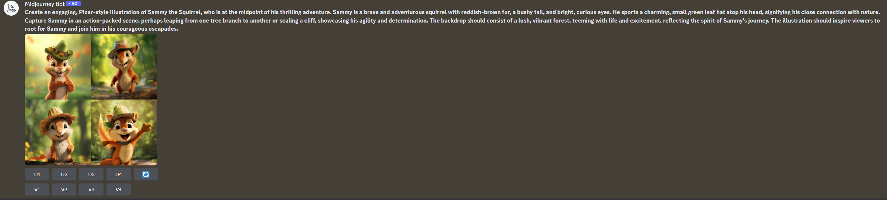
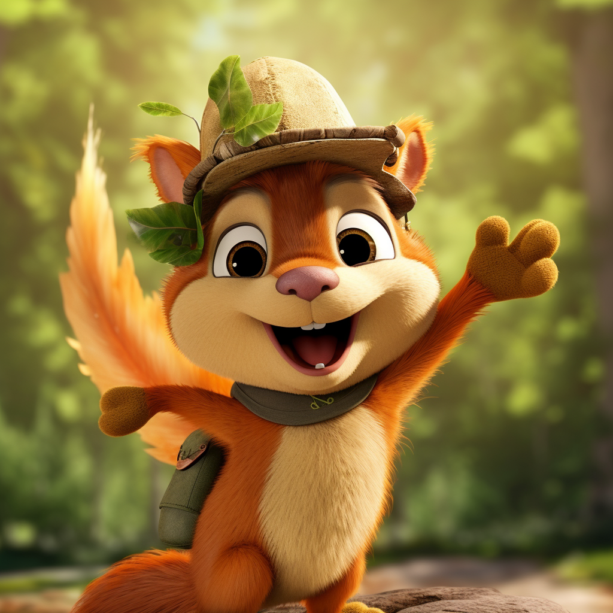
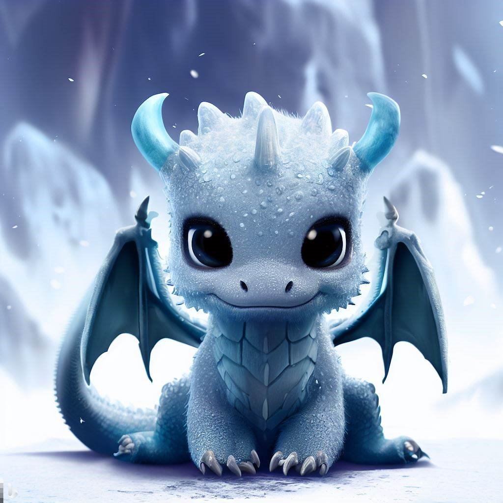

# How to Create a Children's Book with AI Tools
 
This repository provides a guide on how to create a children's book using AI tools, specifically Azure OpenAI. We will cover the process of creating a book, from generating the story to creating illustrations, with the help of Azure OpenAI's GPT-4.

## Table of Contents
 

- [How to Create a Children's Book with AI Tools](#how-to-create-a-childrens-book-with-ai-tools)
  - [Table of Contents](#table-of-contents)
  - [Introduction](#introduction)
  - [Setting Up the Tools](#setting-up-the-tools)
  - [Creating the Book's Story](#creating-the-books-story)
  - [Using the Azure OpenAI Studio](#using-the-azure-openai-studio)
  - [Generating Image Prompts](#generating-image-prompts)
  - [Image Creation with AI](#image-creation-with-ai)
    - [Midjourney](#midjourney)
    - [Bing Image Creator](#bing-image-creator)
    - [DALL-E](#dall-e)
    - [Stable Diffusion](#stable-diffusion)
    - [Microsoft Designer](#microsoft-designer)
  - [Conclusion](#conclusion)

## Introduction
 
Creating a children's book can be a daunting task, but with the help of AI tools like Azure OpenAI's GPT-4, the process can be streamlined and more enjoyable. This guide will walk you through the steps required to generate a unique and engaging story, as well as provide guidance on creating illustrations to accompany the text.
In this guide I'm using Azure OpenAI with GPT-4 model since it's the most advanced version of the Azure OpenAI models.

## Setting Up the Tools
 
Before diving into the book creation process, you'll need to get access to Azure OpenAI (or similar tool from OpenAI, but in this case we'll focus on Azure OpenAI).
You also need access to some of the AI assisted image creation tools like Midjourney, Microsoft Designer, OpenAI Dall-E, Bing Image Creator or stable diffusion. In order to keep this guide simple, we'll focus on Midjourney.
Follow the steps below to get started:

* [Get Azure Subscription](https://azure.microsoft.com/en-us/free/)
* [Sign up for Azure OpenAI](https://aka.ms/oaiapply)
* [Sign up for GPT-4 model](https://aka.ms/oai/get-gpt4)
* [Create Azure OpenAI instance and Deploy GPT-4 model](https://learn.microsoft.com/en-us/azure/cognitive-services/openai/how-to/create-resource?pivots=web-portal)
* [Midjourney](https://midjourney.com/)

 

## <a id="Creating-the-Books-Story">Creating the Book's Story
 
To create the story for your children's book, you'll need to construct a prompt for Azure OpenAI's GPT-4 model. This prompt should include all the details that you want to include into the book like:
* The target audience (e.g., children aged 4-6)
* The desired length of the story
* The main theme or topic
* Any specific characters and their details
* Framework for the story
* Imagess with image placeholders

Note that the more details you include into the prompt the better Azure OpenAI knows what kind os book you want.

Here's an example of a prompt:
___
Create a **children's story** for **ages 4-6** that is approximately **30 pages** long. The story should be **set in a magical forest** and feature the **following characters**:
* **Sammy the Squirrel**: Sammy is a brave and adventurous squirrel with a bushy tail and bright, curious eyes. He has reddish-brown fur and wears a small, green leaf hat on his head. He is known for his kindness and willingness to help others in need.
* **Luna the Ladybug**: Luna is Sammy's best friend. She has a shiny red shell with black spots and a friendly smile. Luna is wise, resourceful, and always has a clever idea or solution to any problem. She wears a tiny purple flower as a backpack, which holds various magical items.
* **Oliver the Owl**: Oliver is an elderly owl with a white beard and large, round glasses. He has gray feathers and is the guardian of the magical forest. Oliver is knowledgeable about the forest's history and its magical secrets. He lives in a treehouse filled with books and ancient scrolls.

The **story should revolve around Sammy, Luna, and Oliver** going on a **quest to save the magical forest from an evil sorcerer** who is trying to steal its magic. The story should be **easy to understand, engaging, and have a clear beginning, middle, and end**. Along their journey, the characters should **face challenges** that **test their friendship and teamwork**. In the end, they should **discover the true meaning of friendship** and the power of working together to save their home.

Incorporate vivid descriptions of the magical forest, the challenges they face, and the unique qualities of each character. The story should also include moments of humor, suspense, and excitement to keep young readers engaged.

Since it's children's book, **it should have images in each page**. While generating the story please **create images placeholders for each page by typing [PIC: "midjourney prompt"]** where "midjourney prompt" contains the actual prompt that can be used in Midjourney to generate the images. **Images should match the story and content in that page**.
___

 ## <a id="Using-the-Azure-OpenAI-Studio">Using the Azure OpenAI Studio
 
To generate the story, use the Azure OpenAI Studio as follows:

 * **System message**: You can define the system message. Basic system message works fine but in order to control GPT-4 model behavior, you can modify the system message. When creating a children's book it could be something like "You're an experienced children's book writer. Your job is to help user to create a children's book." The more you define the details into your system message, the more it affects to the personality and behavior of Azure OpenAI. 
 * **Parameters**: There are some settings you should change to get best out of the Azure OpenAI Studio.
     * **Deployments**: Choose one of the models you deployed. To get best output you should use one of the latest models GPT-4 or GPT-4-32k. The 32k-version supports up to 32,000 tokens (approximately 24,000 words) as prompt history, making it the ideal model for longer book projects that may require rewriting portions or chapters.
     * **Max response**: Increase the amount of Max response tokens from initial value. This makes sure that AI has enough tokens to generate your story.
     * **Past messages included**: Increase the amount of past messages tokens so that you can have longer conversations with GPT-4.
 * **User prompt**: Add your prompt to User message box when you want AI to do something. E.g. "write me a book of pink elephant."
 * **AI response**: Monitor AI response and ask it to do changes or tune your initial book creation prompt if the answer doesn't look what you were expecting.
 
 

## <a id="Generating-Image-Prompts">Generating Image Prompts
 
As you generate the story, you may want to include illustrations at various points. To do this, you can ask Azure OpenAI to create the image creation prompts for you while it's creating the book. For example like above:
"Since it's children's book, it should have images in each page. While generating the story please create image placeholders for each page by typing **[PIC: "midjourney prompt"]** where "midjourney prompt" contains the actual prompt that can be used in Midjourney to generate the images. Images should match the story and content in that page.  
 
You can also create images separately by hand by using one of the AI tools below or you can ask Azure OpenAI to create detailed image creation prompts for you like this:

 

## <a id="Image-Creation-with-AI">Image Creation with AI
When you have your image prompts ready you can use some of the available tools to generate your images.
There are multiple tools available, some of them are free, some of them cost something but most of them allows you to test them without any costs.
Test same prompts with multiple tools to get an idea which tool provides the most suitable image look and feel for your needs. In my own tests I noticed that
 1. Midjourney provides most realistic images
 2. Bing Image creator is some times best for children book images because of style it provides
 3. Stable diffusion needs most finetuning and configurations but provides images by using your own hardware if installed into your own computer.
 
Note that creating multiple similar images that look the same is probably not as easy as you could think. As an example if you try to create and image of squirrel that sits in a chair and after that squirrel that drives a car, the squirrels are not looking exactly the same.
There are ways to tackle these challenges by using previous image as source image etc. but note that it can get complicated and time consuming... But then again... So it does with PhotoShop or Gimp.

 ### Midjourney
To get started with Midjourney have a look at their [Quick Start Guide](https://docs.midjourney.com/docs/quick-start)

 When you enter a prompt into Midjourney discord bot, you'll get multiple versions where you can select one or create other versions from specific pic. In here i'm using the image creation prompt I generated with Azure OpenAI:

 
When you get the result you're looking for you can hit the U# button that'll upscale one of the images for you:

 
### Bing Image Creator
Bing image creator (powered by DALL-E) is one of the latest tools to create images with AI. You can test it [here](https://www.bing.com/create)
 
### DALL-E
Test it out [here](https://openai.com/product/dall-e-2)
 
### Stable Diffusion
One of the best benefits of Stable Diffusion is that you can install it into your own computer.
Have a look [here](https://stablediffusionweb.com/)
 
 ### Microsoft Designer
 Have a look also at [Microsoft Designer](https://designer.microsoft.com/) and [blog post](https://www.microsoft.com/en-us/microsoft-365/blog/2023/04/27/microsoft-designer-expands-preview-with-new-ai-design-features/) about it.

 ___
Once you have the illustration suggestions, you can use one of the image generation AI tools to create the actual images.

Follow the instructions provided by the image generation AI tool to generate the illustrations for your book.

## <a id="Conclusion">Conclusion
 
By following this guide, you can create a captivating children's book using AI tools like Azure OpenAI's GPT-4 and Midjourney. 
After creating the book you can use tools like Microsoft Publisher which is a great app for creating visually rich, professional-looking publications without investing lots of money and time in a complicated desktop publishing application.

Remember to experiment with different prompt structures, tools and parameters to achieve the desired results. Good luck, and happy book creation!

